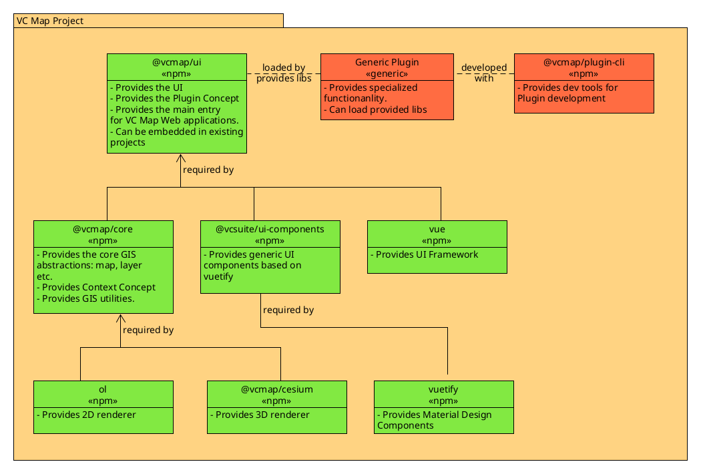

# VC Map
VC Map is an Open-Source JavaScript framework and API for building dynamic and interactive maps on the web. It can display
2D data, oblique imagery and massive 3D data including terrain data, vector data, mesh models, and point clouds making it
easy for users to explore and interact with the data in an integrated and high-performance map application. VC Map apps can
be rendered in all modern web browsers and on both desktop and mobile devices, bringing the map to where the user is.
VC Map is built upon open, proven, and reliable GIS and web technologies such as [OpenLayers](https://github.com/openlayers/openlayers)
and [Cesium](https://github.com/cesiumGS/cesium/) for the visualization of 2D and 3D geo-data. It can load and display data
from various sources and in different formats including open OGC standards and interfaces. Users can easily switch between
the 2D, oblique and 3D views and dynamically add map layers to the scene that are accessible in all views. The VC Map
framework offers ready-to-use map tools and widgets that can be flexibly combined in a VC Map app to meet the needs and demands of end-users and the target audience. Examples are navigation controls, map layers and legends, drawing and editing tools, split screens, camera flights, and GIS tools such as measurements, height profiles, view shed analysis, or real-time shadows.
VC Map provides a strong programming API for developers that makes it easy to build customized VC Map applications,
to integrate VC Maps into any web page and to extend its functionalities with own plugins. The VC Map framework and API
is structured into the following four main architectural layers:

#### [VC Map Core](https://github.com/virtualcitySYSTEMS/map-core)
The VC Map Core is a thin abstraction layer and wrapper around OpenLayers and Cesium. It provides a common data and feature
management API and automatically synchronizes data and user actions between the 2D, oblique and 3D views. Map functions and
tools can be developed against this Core API to make them available in 2D, 3D and the oblique view rather than having to
develop them redundantly and based on different technologies.

#### Configuration Management
The VC Map framework offers a flexible and fully customizable map configuration management. All contents of a VC Map application
such as available layers, views, tools, and plugins are managed in a JSON-based configuration file that is loaded when starting
the application. Every VC Map application can thus be easily configured according to the end-user needs. Map configurations can
be dynamically changed, extended, and serialized at runtime through a corresponding API.

#### Modern User Interface
VC Map comes with a modern UI interface for VC Map applications that provides UI components for all map tools and widgets
implemented based on Vue.js and HTML5. In addition, the VC Map framework provides pre-built, low-level UI elements that can
be used by developers to easily build more complex user dialogs from and include them in a map application.

#### [Plugin API](https://github.com/virtualcitySYSTEMS/map-plugin-cli)
VC Map is easy to customize and extend through a well-defined Plugin API. Plugins allow for adding new functionalities,
tools, and user dialogs to a VC Map application. Plugins can be added to a VC Map through the configuration file or loaded
dynamically to an existing map application using the Plugin API. Plugin developers can use the entire VC Map stack
(VC Map Core, configuration management, UI components) for building their own extensions.

# Components
### [@vcmap/core](https://github.com/virtualcitySYSTEMS/map-core)
Provides an abstraction layer around 2D, 3D and oblique Maps. Provides the following components:
- map abstraction for Cesium, Openlayers and Oblique Images
- layers
- interactions
- styles
- application and context/config handling

### [@vcsuite/ui-components](https://github.com/virtualcitySYSTEMS/suite-ui-components)
Collection of reusable dumb ui components. For example textfield, checkbox, lists, icons. The components are build on top of [vuetify](https://github.com/vuetifyjs/vuetify)

### [@vcmap/ui](https://github.com/virtualcitySYSTEMS/map-ui)
This Project, provides
- a configurable and extendable ui
- extends the @vcmap/core application handling with a plugin Concept, see [@vcmap/plugin-cli](https://github.com/virtualcitySYSTEMS/map-plugin-cli)
- extends the @vcmap/core application with a windowManager 

### [@vcmap/plugin-cli](https://github.com/virtualcitySYSTEMS/map-plugin-cli)
Provides a tool to create, develop and build Plugins for the @vcmap/ui.
Plugin Concept documentation can also be found there. 

### [@vcmap/ui webpack5 integration template](https://github.com/virtualcitySYSTEMS/map-ui-webpack5-example)
Example Template to show how to integrate the @vcmap/ui in a webpack5 project.

### [@vcmap/core demo](https://github.com/virtualcitySYSTEMS/map-core-demo)
Example demo Application based on the @vcmap/core, shows how to implement a different UI on top of the @vcmap/core

## Component Diagram

# Project and Component Status
The Project is currently in Alpha status. Different components have different states. For development check here 
how safe it is to start developing with these components.

#### States:
- TODO: not yet usable
- ALPHA: 1. version, style and API will probably change
- BETA: Style and API may change, we will provide a changelog from here on.
- RC: Styles and API are most likely stable for the release / Featurecomplete.
- STABLE: conforms to SemVer concept. 

### @vcsuite/ui-components
- VcsTextField BETA
- VcsCheckbox BETA
- VcsSelect BETA
- VcsButton ALPHA
- VcsFormattedNumber BETA
- VcsLabel BETA
- VcsTooltip ALPHA 
- VcsActionButtonList ALPHA 
- VcsActionList ALPHA 
- VcsFormSection ALPHA 
- VcsTreeView ALPHA 
- VcsTreeViewItem ALPHA 
- VcsList TODO 
- VcsListItem TODO
- VcsBadge ALPHA 
- VcsColorPicker TODO 
- VcsDatePicker TODO

### @vcmap/core
- Context Concept RC
- Categories Concept BETA
- Layers/Maps RC
- Styles: BETA
- Interactions: BETA
- oblique RC
- FeatureProvider BETA
- ClassRegistry BETA
- Editor TODO

### @vcmap/ui
- contentTree API BETA
- windowManager API BETA
- Navbar/ButtonManager/ToolboxManager ALPHA
- OrientationTools BETA
- ActionConcept BETA
- PluginConcept RC
- SEARCH API TODO

# Getting started
For a first start, clone the repo and call `npm i` `npm run start` This will start a development server. The 
app can be opened with http://localhost:8080.

Further Information see [Development](documentation/DEVELOPMENT.md) and [Plugin-cli](https://github.com/virtualcitySYSTEMS/map-plugin-cli).

## Included Dataset
The included datasets for Berlin and Osnabrück in the app configurations in the project can only be used for Development.
For further usage of the datasets please contact [Virtual City Systems](https://vc.systems).

