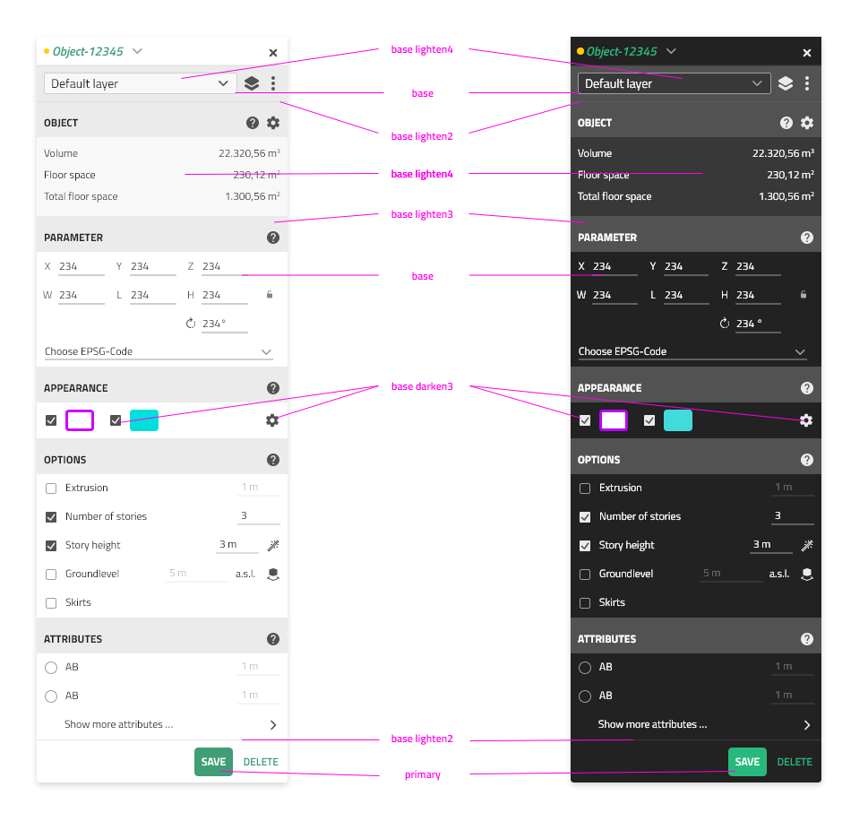

# Theming

The VC Map UI supports a light and a dark theme.
All components are automatically updated by vuetify on theme change.
Additionally, the [VcsUiApp](../src/vcsUiApp.js) fires a `themeChanged` event, when the theme changes from light to dark, vice versa or a newly added context changes the primary color.

## Primary color

The interface of the VC Map is based on an individual monochromatic grey color scheme (`base`) combined with one accent/cooperate
design color (`primary`).

The primary color can be configured within a context (see [UI CONFIG](./UI_CONFIG.md)):

```json
{
  "uiConfig": [
    {
      "name": "primaryColor",
      "value": "#FFCE00"
    }
  ]
}
```

The primary color can also be configured for light/dark mode

```json
{
  "uiConfig": [
    {
      "name": "primaryColor",
      "value": {
        "dark": "#232D52",
        "light": "#ff0000"
      }
    }
  ]
}
```

## Text colors

Text colors are set automatic and are calculated based on the background color, so that the contrast is high.
The text Colors can be accessed via css variables: `rgb(var(--v-theme-on-surface))` or `rgb(var(--v-theme-on-primary))`
or `rgb(var(--v-theme-on-primary--lighten-5))`.
These classes work in and dark/light mode. If necessary they can be customized by overwriting them in the vuetifyThemes uiConfig Object.

```
    variables: {
        'theme-on-surface': '#ff0000'
    }
```

To highlight text/anchor/icons use class (`text-primary`) as shown:

```html
<v-icon class="text-primary"> <span class="text-primary">text</span></v-icon>
```

## VCS Color palette

The VC Map UI pre-defines a coherent color scheme for a light and dark theme.
The color scheme is based on the vuetify [color class system](https://vuetifyjs.com/en/styles/colors/) and overwrites it where
necessary.

The table below shows all color keys and corresponding hex codes.

<style>
#grid {
    display: grid;
    grid-template-columns:  1fr 1fr 10px 1fr 1fr;
    grid-gap: 10px;
    margin-bottom: 40px;
}
#grid > div {
    color: white;
    padding: 10px;
}
#grid > div.colum-spacer{
grid-area: 1 / 3 / span 13 / span 1;
}
#grid > div.row-spacer{
grid-area: 12 / 1 / 12 / 6;
}
</style>
<div id="grid">
<div class="colum-spacer"></div>

<div><b>Light theme</b></div>
<div><b>Dark theme</b></div>
<div><b>Light theme</b></div>
<div><b>Dark theme</b></div>
<div style="background:#9e9e9e"><!--light--> --v-theme-base: #9e9e9e</div>
<div style="background:#9e9e9e">--v-theme-base: #9e9e9e</div>
<div style="background:#409d76"><!--light--> --v-theme-primary: #409d76</div>
<div style="background:#27b97c">--v-theme-primary: #27b97c</div>

<div style="background:#b8b8b8; color: black;"><!--light--> --v-theme-base-lighten-1: #b8b8b8</div>
<div style="background:#858585">--v-theme-base-lighten-1: #858585</div>
<div style="background:#5cb890; color: black;"><!--light--> --v-theme-primary-lighten-1: #5cb890</div>
<div style="background:#4dd596; color: black;">--v-theme-primary-lighten-1: #4dd596</div>

<div style="background:#d0d0d0; color: black;"><!--light--> --v-theme-base-lighten-2: #d0d0d0</div>
<div style="background:#6b6b6b">--v-theme-base-lighten-2: #6b6b6b</div>
<div style="background:#78d4aa; color: black;"><!--light--> --v-theme-primary-lighten-2: #78d4aa</div>
<div style="background:#6cf2b1; color: black;">--v-theme-primary-lighten-2: #6cf2b1</div>

<div style="background:#ebebeb; color: black;"><!--light--> --v-theme-base-lighten-3: #ebebeb</div>
<div style="background:#525252">--v-theme-base-lighten-3: #525252</div>
<div style="background:#94f1c6; color: black;"><!--light--> --v-theme-primary-lighten-3: #94f1c6</div>
<div style="background:#8bffcc; color: black;">--v-theme-primary-lighten-3: #8bffcc</div>

<div style="background:#f8f8f8; color: black;"><!--light--> --v-theme-base-lighten-4: #f8f8f8</div>
<div style="background:#383838">--v-theme-base-lighten-4: #383838</div>
<div style="background:#b0ffe2; color: black;"><!--light--> --v-theme-primary-lighten-4: #b0ffe2</div>
<div style="background:#a9ffe9; color: black;">--v-theme-primary-lighten-4: #a9ffe9</div>

<div style="background:#ffffff; color: black;"><!--light--> --v-theme-base-lighten-5: #ffffff</div>
<div style="background:#ffffff; color: black;">--v-theme-base-lighten-5: #ffffff</div>
<div style="background:#cdfffe; color: black;"><!--light--> --v-theme-primary-lighten-5: #cdfffe</div>
<div style="background:#c6ffff; color: black;">--v-theme-primary-lighten-5: #c6ffff</div>

<div style="background:#858585"><!--light--> --v-theme-base-darken-1: #858585</div>
<div style="background:#b8b8b8; color: black;">--v-theme-base-darken-1: #b8b8b8</div>
<div style="background:#20825d"><!--light--> --v-theme-primary-darken-1: #20825d</div>
<div style="background:#009d63">--v-theme-primary-darken-1: #009d63</div>

<div style="background:#6b6b6b"><!--light--> --v-theme-base-darken-2: #6b6b6b</div>
<div style="background:#d0d0d0; color: black;">--v-theme-base-darken-2: #d0d0d0</div>
<div style="background:#006946"><!--light--> --v-theme-primary-darken-2: #006946</div>
<div style="background:#00834b">--v-theme-primary-darken-2: #00834b</div>

<div style="background:#525252"><!--light--> --v-theme-base-darken-3: #525252</div>
<div style="background:#ebebeb; color: black;">--v-theme-base-darken-3: #ebebeb</div>
<div style="background:#00502f"><!--light--> --v-theme-primary-darken-3: #00502f</div>
<div style="background:#006834">--v-theme-primary-darken-3: #006834</div>

<div style="background:#383838"><!--light--> --v-theme-base-darken-4: #383838</div>
<div style="background:#f8f8f8; color: black;">--v-theme-base-darken-4: #f8f8f8</div>
<div style="background:#00381a"><!--light--> --v-theme-primary-darken-4: #00381a</div>
<div style="background:#004f1e">--v-theme-primary-darken-4: #004f1e</div>

</div>

### Usage within VC Map UI

To ensure the harmonious color scheme through the whole map application, it is vital that colors are used correctly:

| Color key      | Description and usage                                                                          |
| -------------- | ---------------------------------------------------------------------------------------------- |
| primary        | Global accent color (VCS Green)                                                                |
| accent         | Unused (vuetify standard color, replaced by: 'base-lighten-3' )                                |
| base           | For input/selectbox borders (stays the same in light and dark mode)                            |
| base-lighten-5 | Text and icon color on standard and large buttons(VCS special: white in light and dark theme!) |
| base-lighten-4 | Background color for forms and input fields                                                    |
| base-lighten-3 | Former accent color, used in searchbar, Forms accent                                           |
| base-lighten-2 | Dividers(VCS special: twins light/dark theme)                                                  |
| base-darken-3  | Text and icon color on small buttons                                                           |
| base-darken-4  | Use as former secondary color                                                                  |

The following image illustrates where different colors are used on the VC Map user interface


### Example theme configuration

The color palette can be configured via the uiConfig (see [UI CONFIG](./UI_CONFIG.md)).
This can also be used to customize the lighten/darken variations.
Defining the primary Color via `vuetifyTheme` uiConfig has priority over directly defining the primaryColor.

```json
{
  "uiConfig": [
    {
      "name": "vuetifyTheme",
      "value": {
        "light": {
          "colors": {
            "base": "#9E9E9E",
            "base-lighten-5": "#FFFFFF",
            "base-lighten-4": "#F8F8F8",
            "base-lighten-3": "#EBEBEB",
            "base-lighten-2": "#D0D0D0",
            "base-lighten-1": "#B8B8B8",
            "base-darken-1": "#858585",
            "base-darken-2": "#6B6B6B",
            "base-darken-3": "#525252",
            "base-darken-4": "#383838",
            "warning": "#FFCE00",
            "error": "#AA0000",
            "info": "#2196F3",
            "success": "#4CAF50",
            "surface-light": "#ffffff"
          },
          "variables": {
            "hover-opacity": 0.16,
            "high-emphasis-opacity": 1,
            "medium-emphasis-opacity": 1,
            "vcs-font-size": "14px",
            "vcs-font-family": "Times New Roman"
          }
        },
        "dark": {
          "colors": {
            "base": "#9E9E9E",
            "base-lighten-5": "#FFFFFF",
            "base-lighten-4": "#383838",
            "base-lighten-3": "#525252",
            "base-lighten-2": "#6B6B6B",
            "base-lighten-1": "#858585",
            "base-darken-1": "#B8B8B8",
            "base-darken-2": "#D0D0D0",
            "base-darken-3": "#EBEBEB",
            "base-darken-4": "#F8F8F8",
            "warning": "#FFCE00",
            "error": "#FF5252",
            "info": "#2196F3",
            "success": "#4CAF50",
            "surface-light": "#222222"
          },
          "variables": {
            "hover-opacity": 0.16,
            "high-emphasis-opacity": 1,
            "medium-emphasis-opacity": 1,
            "vcs-font-size": "14px",
            "vcs-font-family": "Times New Roman"
          }
        }
      }
    }
  ]
}
```

### Color Usage examples

The following examples illustrate, how the color scheme can be used in vue components (or style sheets) and javascript code.

#### As color prop

]()
A button in primary color:

```html
<VcsButton color="primary"> ... </VcsButton>
```

An alert:

```html
<v-alert color="base-lighten-2"> ... </v-alert>
```

#### As CSS color class

A component with text in primary color:

```vue
<MapNavCompass class="text-primary" />
```

#### In SCSS

Active item:

```scss
.v-list-item--active {
  background-color: rgb(var(--v-theme-primary-lighten-1));
  border-bottom: 1px solid rgb(var(--v-theme-primary-lighten-4));
}
```

Hovering effects:

```scss
&:hover {
  color: rgb(var(--v-theme-base-lighten-5)) !important;
  border-color: rgb(var(--v-theme-primary));
  background-color: rgb(var(--v-theme-primary-dark-1));
}
```

#### In Javascript

The @vcmap/ui package exports utility functions to access colors in javascript.
This is helpful to style a layer or feature according to the color scheme.

To get the default primary color use:

```js
import { getDefaultPrimaryColor } from '@vcmap/ui';

const defaultPrimaryColor = getDefaultPrimaryColor();
```

To access a color or color variation, you can simply do:

```js
import { getColorByKey } from '@vcmap/ui';

const primary = getColorByKey('primary');
const baseLighten2 = getColorByKey('base', 'lighten-2');
```

To listen to theme changed event and update a style:

```js
import { VectorLayer, VectorStyleItem } from '@vcmap/core';
import { getDefaultPrimaryColor } from '@vcmap/ui';
import { getColorByKey } from '@vcmap/ui';

const layer = new VectorLayer();
const style = new VectorStyleItem({
  fill: {
    color: 'rgba(237, 237, 237, 0.1)',
  },
  stroke: {
    color: getDefaultPrimaryColor(),
    width: 5,
  },
});
layer.setStyle(style);

app.themeChanged.addEventListener(() => {
  const color = getColorByKey('primary');
  style.stroke?.setColor(color);
  layer.forceRedraw(); // update style on all features
});
```

## Extended Theming

Vuetify Theming can be used to create custom css variables, see [vuetify.js](../src/vuePlugins/vuetify.js).
We use this to configure the following vcs variables:

- `vcs-font-size` To globally set the default fontsize. Allows customers to configure a map with larger fonts.
  The fontsize should have valid values between 10 and 24px.
- `vcs-font-family` Sets font Family

These variables can be configured via the uiConfig (see [example theme configuration](#example-theme-configuration) and [UI CONFIG](./UI_CONFIG.md)).

These variables can be used in CSS with `var(--v-vcs-font-size)`
Also CSS can be used to calculate values `calc(var(--v-vcs-font-size) - 1px)`;
Most height values within the VC Map like the height of buttons, list items, navbar, toolbar and more is calculated based on the `fontSize`

For the fontSize a helper function is exported, which can be used to set size properties in html:
There is also `useIconSize` helper which will return the default small Icons Size as a computed based on the `fontSize`

```js
const fontSize = useFontSize();
const iconSize = useIconSize();
```

```vue
<v-btn :size="fontSize * 2"></v-btn>
<v-icon :size="iconSize">mdi-chevron</v-icon>
```
