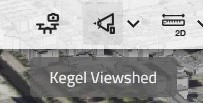
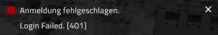
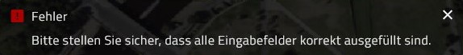

# VC Map UI / UX

## Inhaltsverzeichnis

1. [Allgemeine Grundsätze](#allgemeine-grundsaetze)
2. [Tooltips](#tooltips)
   - [Allgemeine Grundsätze Tooltips](#allgemeine-grundsaetze-tooltips)
   - [Aufbau](#aufbau)
   - [Fall: Clickbare Icons /Buttons ohne Text (nebenstehend)](#fall-clickbare-icons-oder-buttons-ohne-text)
   - [Fall: Rein textbasierte Menüeinträge + Kombinierte Menüeinträge Icon & Text](#fall-rein-textbasierte-menueeintraege-und-kombinierte-menueeintraege-icon-und-text)
   - [Fall: Texte werden aufgrund von Platzmangel abgeschnitten](#fall-texte-werden-aufgrund-von-platzmangel-abgeschnitten)
   - [Fall: Tooltip - Fehlermeldung](#fall-tooltip---fehlermeldung)
3. [Text / Ansprache](#text-und-ansprache)
   - [Allgemeine Grundsätze Text / Ansprache](#allgemeine-grundsaetze-text-und-ansprache)
   - [Fall: Platzhaltertexte](#fall-platzhaltertexte)
   - [Fall: Label)](#fall-label)
   - [Fall: Fehlermeldungen](#fall-fehlermeldungen)

## Allgemeine Grundsaetze

- **Zielgruppe der Kartenanwendung:** Nicht-Fachnutzer ohne GIS- und
  erweiterten Sprachhintergrund

- **Sprache:** es kann nicht von Mehrsprachigkeit oder Fachsprache ausgegangen werden =\>
  Denglish vermeiden (v.a. im Deutschen sollten geeignete
  deutschsprachige Bezeichnungen verwendet werden) =\> Tools, Texte,
  Label, etc. eindeutig und sinnvoll übersetzen  
  Bsp. Tool \--\> Werkzeug, Extent \--\> Ausdehnung, Layer \--\> Ebene

## Tooltips

### Allgemeine Grundsaetze Tooltips

- Gleiche Funktionen UI-übergreifend mit einheitlichen Tooltips versehen
  (Wortwahl)

- Unterschiedliche Funktionen nicht mit dem gleichen Tooltip beschreiben

- Der Tooltip sollte vom Umfang her nicht mehr als einen kurzen
  aussagekräftigen Satz umfassen

- Tooltips werden so formuliert, dass sie möglichst statisch
  funktionieren \--\> Tooltips sind zustandslos!

> _Bsp. \"Schatten simulieren\" anstatt \"Schattentool öffnen\"_
>
> **Eine mögliche Ausnahme davon könnte Show/Hide auf Auge sein**

- Checkbox ist ein gewohntes UI Element und benötigt keinen Tooltip

### Aufbau

**Regel:** **\<Objekt\> + \<Aktion\>**

**Die Aktion sollte ebenfalls \"stateless\" sein und das auch so
ausdrücken.**

_Beispiele:_

> _\"**(i)**\" =\> \"**Informationen aufrufen**\"_
>
> _\"**Header-Share**\"
> =\> \"**Aktuellen Kartenausschnitt teilen**\"_
>
> _\"**Drawing-Polygon**\"
> =\> \"**Polygone zeichnen**\"_
>
> _\"**Schattentool öffnen**\"
> =\> \"**Schatten simulieren**\"_

_Von **\<Objekt\> + \<Aktion\>** kann abgewichen werden, wenn kein
sinnvolles Verb / Aktion gefunden werden kann, dass eine zustandslose
Aktion ausdrückt. Wenn das Verb nur ein Füllwort ist, kann es
weggelassen werden.  
zum Beispiel folgende Abweichungen:_

> _\"Mehrfachansicht\" vs. \"Mehrfachansicht öffnen\"_
>
> _\"Legende\" vs. \"Legende anzeigen\" _
>
> _\"Inhalte\" =\> \"Inhalte anzeigen\" _
>
> _\"Mein Arbeitsbereich\" =\> \"Mein Arbeitsbereich öffnen\" _

> **Do's:**
>
>  

> **Dont's:**
>
> \<Verb\>\<Objekt\>
>
> 
>
> Mix von \<Objekt\>+\<Aktion\>
>
>  > 
>
> Annahme des englischen Begriffs als Eigenname
>
>  >  > 
>
> Verwendung des gleichen Tooltip für unterschiedliche Button:
>
>  

### Fall: Clickbare Icons oder Buttons ohne Text

**Verfügbarkeit:** verpflichtend, betrifft alle Icons die clickbar sind!

**Ausnahme:** Checkbox

> Beispiele:  
> 
>
> 

### Fall: Rein textbasierte Menueeintraege und Kombinierte Menueeintraege Icon und Text

**Verfügbarkeit**: optional

**Regel:** Textbasierte Menüeinträge sollten grundsätzlich selbsterklärend sein,
nur wenn eine weitere Erläuterung zum Verständnis absolut notwendig ist,
sollte ein Tooltip den Eintrag ergänzen  
**Bedingung**: Der Tooltip sollte einen echten Mehrwert bieten (d.h. das
Element / die Aktion detaillierter beschreiben) und nicht nur eine
Wiederholung des Menüeintrages sein.

\--\> Einzelfallentscheidung des Feature Managers in Anlehnung an
bestehende Tooltips

**\"Don\'t:** **\"Zoom auf Ebene\"** **=\> \"Auf Ebene zoomen**\"

Beispiel: \"**Alle selektieren**\" =\> **\"Alle Elemente dieser Gruppe
selektieren\" / „Select all elements of this group."**

Beispiel: **\"Auf Ebene zoomen\"** =\> **\"Auf die volle Ausdehnung der
Ebene zoomen\" / „Zoom to the full extent of the layer."**

#### Sonderfall Kontextmenu

**Regel:** ==\> **Kein Tooltip im Kontextmenu**

### Fall: Texte werden aufgrund von Platzmangel abgeschnitten

**Regel:** Es wird der gesamte Text automatisch on hover als Tooltip angezeigt

### Fall: Tooltip - Fehlermeldung

**Verfügbarkeit:** verpflichtend

**Regel:** Vollständiger Satz \--\> Fokus positiv: Was ist erforderlich, um den
Fehler zu beheben.

## Text und Ansprache

### Allgemeine Grundsaetze Text und Ansprache

- **Aufforderungen** sollen in formeller Ansprache erfolgen.

> _Beispiel: Klicken **Sie** zweimal in die Karte. ..._

- **Beschreibende** Texte sollen in neutraler Ansprache erfolgen.

> **Beispiel deutsch:** \"Flächenauswahl: Das Zeichnen einer Geometrie ermöglicht den Export aller innerhalb der Geometrie befindlichen Objekte.\*\*
>
> **Beispiel englisch:** \"Area selection: Drawing a geometry allows the export of all objects located within the geometry.\"

- Wenn sinnvoll, kann eine formelle Ansprache mit einem beschreibenden
  Text kombiniert werden. Dabei sollte die persönliche Ansprache
  vorangestellt werden.

**Regel:** **\<Ansprache\>\<Erläuterung\>**

> **Beispiel deutsch:** \"Klicken **Sie** zweimal in die Karte. Der erste Klick ermöglicht... . Der zweite Klick ..."
>
> **Beispiel englisch:** \"Click twice on the map. The first click
> enables... . The second click ...\"\*

> Bsp. Tool \--\> Werkzeug, Extent \--\> Ausdehnung, Layer \--\> Ebene
> (siehe auch Glossar)
>
> Negativbeispiel: \"**Shadow Tool Fenster öffnen**\"

- Im Englischen:

  - **Entsprechend Google Richtlinie: Sentence Style verwenden**

  - **Erstes Wort groß =\> Rest klein**

### Fall: Platzhaltertexte

- **immer Angabe eines Platzhalters, wenn kein Default-Wert im
  Inputfeld!!**

- direkte Ansprache wählen

- Wenn sinnvoll, kann eine formelle Ansprache mit einem beschreibenden
  Text kombiniert werden. Dabei sollte die persönliche Ansprache
  vorangestellt werden. s.o

>

a. **ohne Label:** Angabe der Eigenschaft

> **Beispiele:**
>
> **E-Mail**: E-Mail
>
> **URL**: URL
>
> **Suche**: Suche..., Adresssuche...\_
>
> **Auswahl**: Auswahl...
>
> **Sonstige**: wie Tooltip behandeln
>
> 
>
> 

b. **mit Label:** Angabe als Beispiel

> **Beispiele:**
>
> **E-Mail**: example@mail.de
>
> **URL**: http://www.example.com
>
> **Suche**: Suche..., Adresssuche...
>
> **Auswahl**: Auswahl...
>
> **Sonstige**: wie Tooltip behandeln
>
> \*

### Fall: Label

- **Labeltexte:** _Die Eigenschaft als solches: E-Mail, URL, etc..._

- **Labelwerte:** _Als Eigenschaft beschreiben (Hell / Dunkel =\> Hoch,
  Niedrig)_

### Fall: Fehlermeldungen

- Neutrale Formulierung wählen (_Don\'t blame the user_)

> **Bsp**. \"Es ist eine Auswahl erforderlich\", \"Es muss ein Wert \>0
> gewählt werden\"

- Menschenlesbar (Laie), sollte Rückschluss auf Fehlerursache liefern

> **Bsp. Login** \--\> Eingabefehler oder Serververbindung
> fehlgeschlagen,
>
> **Bsp. Formulare**: Welches Feld, welcher Input wird stattdessen
> erwartet

**Dont:**

> 

- **Unverständlich**

  - **Eingabefehler?**

  - **Fehler bei Serverbindung?**
    

> 

- **Unspezifisch**

  - **Welches Feld?**

  - **Was ist "korrekt**
    
