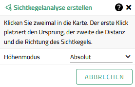
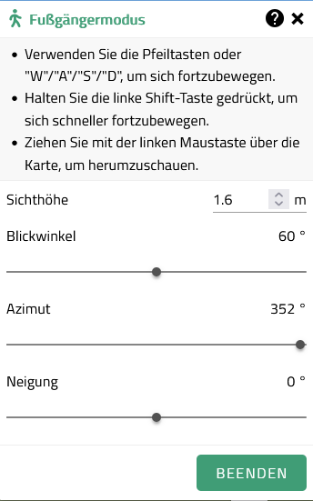
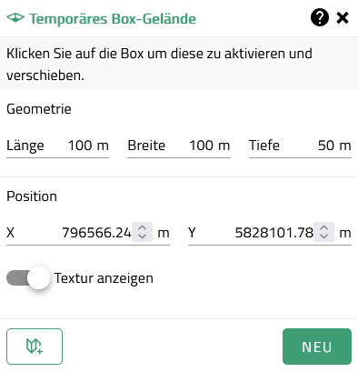
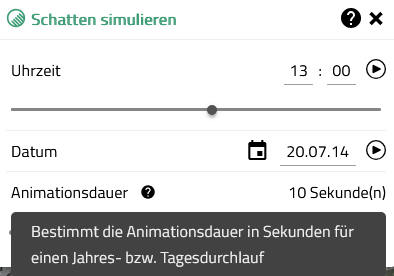
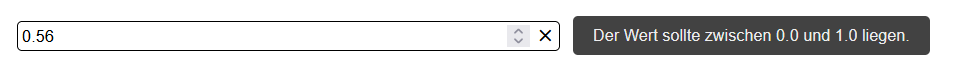
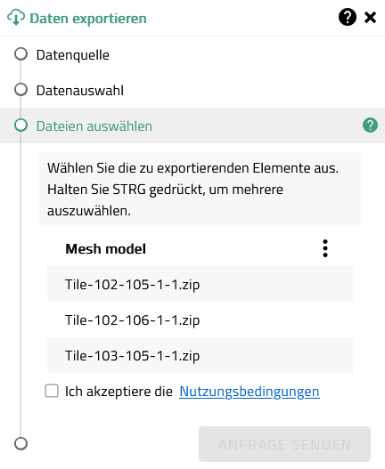
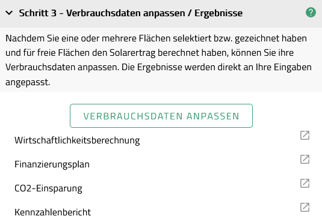

# Nutzung von Supporttexten

## Allgemeine Grundsätze

Zweck: Kurze, direkte Hilfestellung bezüglich einer zu erwartenden Nutzereingabe innerhalb eines Fensters.

## Unterscheidung nach Anwendungsfällen

### Fall: Startanweisung im Tool (Instruktionstext)

UI Komponente: VcsHelp

| Komponente wird als Initialisierungstext zum Start eines Werkzeugs genutzt. |
| :-------------------------------------------------------------------------- |

Wann sinnvoll: Zur Erläuterung erster Schritte.

Beispiele:

> 

### Fall: Erläuterung zur Benutzung eines Werkzeugs

UI Komponente: VcsHelp

| Komponente wird für permanente, ergänzende Hinweise zur allgemeinen Bedienung eines Werkzeuges genutzt. |
| :------------------------------------------------------------------------------------------------------ |

Wann sinnvoll: Wenn Bedienhinweise erforderlich sind (z.B. Hinweise auf Shortcuts oder mögliche Aktionen).

Beispiele:

> 

> 

### Fall: Erläuterung zum Eingabefeld

#### a. mit Label

UI Komponente: helpText prop in VcsLabel

| Komponente wird als eine kurze Erläuterung / Erklärung über die einzustellende Eigenschaft genutzt. |
| :-------------------------------------------------------------------------------------------------- |

Wann sinnvoll: Sofern besonderer Erläuterungsbedarf zur Eigenschaft selbst besteht.

Beispiele:

> 

#### b. ohne Label

UI Komponente: tooltip auf VcsTextField

| Komponente wird als eine kurze Erläuterung / Erklärung über den einzustellenden Wert genutzt. |
| :-------------------------------------------------------------------------------------------- |

Wann sinnvoll: Sofern besonderer Erläuterungsbedarf zur Wahl des Eingabewertes besteht.

Beispiele:

> 

### Fall: Erläuterung zu einem Abschnitt / Schritt

UI Komponente: helpText prop in VcsWizardStep oder VcsFormSection

| Komponente wird genutzt, sofern sich die Erläuterung auf einen Teilschritt eines Wizzards oder einen gesamten Abschnitt bezieht. |
| :------------------------------------------------------------------------------------------------------------------------------- |

Wann sinnvoll: Als eine kurze Erläuterung / Erklärung zum nachfolgenden Schritt.

Beispiele:

> 

> 

