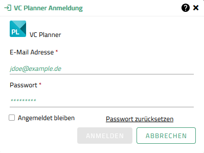

# Formulierung von Texten

## Allgemeine Grundsätze

Es kann nicht von Mehrsprachigkeit oder Fachsprache ausgegangen werden. V.a. im Deutschen sollten geeignete deutschsprachige Bezeichnungen verwendet werden, d.h. Tools, Texte, Labels, etc. sind eindeutig und sinnvoll zu übersetzen.

| Denglish vermeiden! |
| :------------------ |

Negativbeispiel:

> _\"Shadow Tool Fenster öffnen\"_

Beispiele:

> _"Werkzeug" statt "Tool"_  
> _"Ausdehnung" statt "Extent"_  
> _"Ebene" statt "Layer"_

(siehe auch: [Glossar](UIUXGuide_terminology.md))

| In der englischen Schreibweise ist "Sentence Style" zu verwenden (Ausnahme: Eigennamen). |
| :--------------------------------------------------------------------------------------- |
| D.h. erstes Wort groß, danach klein.                                                     |

Beispiele:

> _\"Simulate shadows"_

## Nutzeransprache

| Aufforderungen sollen in formeller Ansprache erfolgen. |
| :----------------------------------------------------- |

Beispiele:

> _Klicken **Sie** zweimal in die Karte. ..._

| Beschreibende Texte sollen in neutraler Ansprache erfolgen. |
| :---------------------------------------------------------- |

Beispiele (DE):

> _ \"Flächenauswahl: Das Zeichnen einer Geometrie ermöglicht den Export aller innerhalb der Geometrie befindlichen Objekte.\*\*_

Beispiele (EN):

> _ \"Area selection: Drawing a geometry allows the export of all objects located within the geometry.\"_

| Wenn sinnvoll, kann eine formelle Ansprache mit einem beschreibenden Text kombiniert werden. Dabei sollte die persönliche Ansprache vorangestellt werden. |
| :-------------------------------------------------------------------------------------------------------------------------------------------------------- |
| Schema: \<Ansprache> + \<Beschreibung>                                                                                                                    |

Beispiele (DE):

> _\"Klicken **Sie** zweimal in die Karte. Der erste Klick ermöglicht... . Der zweite Klick ..."_

Beispiele (EN):

> _"Click the map twice. The first click enables... . The second click ..."_

## Unterscheidung nach Anwendungsfällen

### Fall: Platzhaltertexte

| Es wird immer ein Platzhalter angegeben, wenn kein Default-Wert im Inputfeld gesetzt ist. |
| :---------------------------------------------------------------------------------------- |

#### **a. Inputfeld ohne Label:**

| Wenn kein Label vorhanden ist, wird die Eigenschaft als Platzhalter angegeben. |
| :----------------------------------------------------------------------------- |

Beispiele:

> _**E-Mail**: E-Mail_

> _**URL**: URL_

> _**Suche**: Suche nach Adresse, Ort/Sehenswürdigkeit oder Koordinate X, Y_

> _**Auswahl**: Datenquelle, Selektionsart (je nach Ziel)_

> 

#### b. **Inputfeld mit Label:**

| Wenn ein Label vorhanden ist, wird ein Beispiel als Platzhalter angegeben. |
| :------------------------------------------------------------------------- |

Beispiele:

> _**E-Mail**: example@mail.de_

> _**URL**: http://www.example.com_

> _**Koordinatensuche**: 796602.02, 828841.13_

> 

### Fall: Label

| a. Label für Eingabefelder: Es wird die Einstellung als solche benannt.   b. Label für Eingabewerte: Werden als Eigenschaft beschreiben. |
| :------------------------------------------------------------------------------------------------------------------------------------------ |

Beispiele:

> _**Label des Eingabefeldes**: Anzeigequalität_

> _**Label der Eingabewerte**: \"Niedrig\", \"Mittel\", \"Hoch\" statt  \"Niedrige\", \"Mittlere\", \"Hohe\"_

### Fall: Fehlermeldungen

| Für Fehlermeldungen werden neutrale Formulierungen gewählt. |
| :---------------------------------------------------------- |
| Grundsatz: "Don't blame the user!"                          |

Beispiele:

> \"Es ist eine Auswahl erforderlich\."

> \"Es muss ein Wert \>0 gewählt werden\."

| Fehlermeldungen sollten möglichst menschenlesbar und für Laien verständlich ausgedrückt sein und einen Rückschluss auf die Fehlerursache liefern. |
| :------------------------------------------------------------------------------------------------------------------------------------------------ |

Negativbeispiele:

> 
>
> _ = Unverständlich & Denglish_  
> _...ist es ein Eingabefehler oder ist die Serververbindung fehlgeschlagen?_ > _... nicht jeder versteht was ein [401] Fehler ist. Eine spezifische Angabe von Username ist falsch oder Passwort ist falsch, ist aus Sicherheitsgründen nicht erlaubt. Hier sollte also etwas stehen wie, **"Die Verbindung zum Server ist fehlgeschlagen"** oder **"Ihre Eingaben waren nicht korrekt."**_

> 
>
> _= Unspezifisch _  
> _...welches Feld? Was ist "korrekt"?_

### Fall: Menueinträge

#### Hauptmenu

| Hauptmenueinträge legen sprachlich den Fokus auf das Objekt. |
| :----------------------------------------------------------- |
| Schema: \<Objekt>                                            |

Beispiele:

> _Einstellungen, Hilfe, Filter und Effekte_

#### Kontextmenu

| Kontextmenueinträge legen sprachlich den Fokus auf die Aktion. |
| :------------------------------------------------------------- |
| Schema: \<Objekt> + \<Aktion>                                  |

Beispiele:

> _Geometrie editieren, Objekt verschieben, Fußgängermodus starten_

