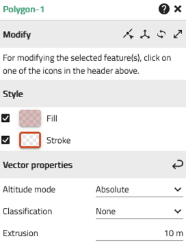
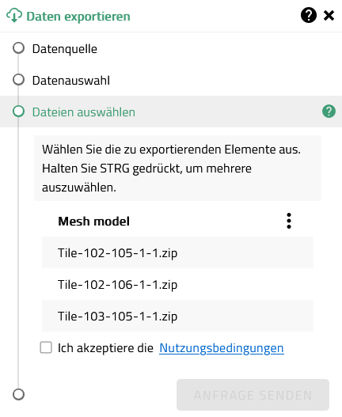

# Fensterkonzeption

## Fenstertypen

### Dialogfenster

<u>Zweck:</u> Erzeugen eines Objektes oder Zustandes.

| Ein Dialogfenster    1. KANN einen Primary Action-Button besitzen (Ausführung: VCSFormbutton - filled), der eine Bestätigungsaktion ausführt (z.B. IMPORT, ANWENDEN, LOGIN, etc.)    2. SOLLTE einen Secondary Action-Button besitzen (Ausführung: VCSFormbutton - outlined), der eine Abbruchaktion ausführt (z.B. Abbrechen, Zurücksetzen) |
| :------------------------------------------------------------------------------------------------------------------------------------------------------------------------------------------------------------------------------------------------------------------------------------------------------------------------------------------------------- |

<u>Wann sinnvoll:</u>

1. Eine Reihe / Sammlung von Eingaben des Nutzers sind notwendig um die Aktion auszuführen.
2. Den Nutzer:innen soll die Möglichkeit gegeben werden, eine Aktion abbrechen zu können.

<u>Anordnung:</u> Einzel-Buttons oder Buttonpaare sind i.d.R. an der rechten Seite des Fensters ausgerichtet.

<u>Verhalten:</u>

1. Ein Klick auf den **Bestätigungsbutton** wendet die Nutzereingabe(n) an und schließt das Dialogfenster (Ausnahmen: Fehlerfälle z.B. Login failed, Nutzereingabe(n) falsch).
2. Ein Klick auf den **Abbruchbutton** verwirft die Nutzereingabe(n) und schließt das Dialogfenster.
3. Ein Klick auf **(X)** des Fensters, schließt das Dialogfenster.

### Fall: Bestätigungsbutton benötigt

| Es wird ein Bestätigungsbutton benötigt, wenn   a. mehrere Nutzereingaben erforderlich sind, um eine Aktion auszuführen.   b. Nutzer:innen den Zeitpunkt des Speicherns eines Bearbeitungsstandes selbst bestimmen können sollen. |
| :-------------------------------------------------------------------------------------------------------------------------------------------------------------------------------------------------------------------------------------- |

Beispiele für gängige Kombinationen:

> 
>
> _"Apply" + "Cancel"_

> 
>
> _"Login" + "Cancel"_

> 
>
> _"Save" + "Reset"_

### Fall: Bestätigungsbutton nicht benötigt

| Es wird KEIN Bestätigungsbutton benötigt, wenn   a. Nutzeraktionen automatisch angewendet werden können (ohne zu einem invaliden Ergebnis zu führen)   b. Berechnungen automatisch durchgeführt werden (Fortschrittsdialog) |
| :-------------------------------------------------------------------------------------------------------------------------------------------------------------------------------------------------------------------------------- |

Beispiele für keinen Bestätigungsbutton:

> 
>
> _Initialisierungsschritt: Eingaben werden direkt angewendet_

> 
>
> _Fortschrittsdialog bei Berechnungen_

### Ausnahme

Fenster, die für den Anwendungsstart vorgesehen sind und bei deren Abbruch die Anwendung nicht gestartet werden könnte, können auch ausschließlich einen Aktionsbutton (Primary Action) besitzen.

Beispiele:

> 
>
> _Splash Screen_

> 
>
> _Modulselektor_

## Eigenschaftsfenster

<u>Zweck:</u> Darstellung von Eigenschaften eines Objektes.

<u>Wann sinnvoll:</u> Wenn Einstellungen direkt angewendet werden sollen, ohne dass eine Nutzerbestätigung erforderlich ist.

<u>Verhalten:</u> Ein Klick auf **(X)** des Fensters, schließt das Eigenschaftsfenster.

### Fall: Werkzeuge, die Objekte direkt erzeugen oder mit der Kartenansicht interagieren

| Werkzeuge, die Objekte direkt erzeugen oder ausschließlich mit der Kartenansicht interagieren, besitzen keine Fußzeile mit Primary-/Secondary-Action Buttons. |
| :------------------------------------------------------------------------------------------------------------------------------------------------------------ |

Beispiele:

> 
>
> _Erzeugt Objekt direkt_

> 
>
> _Interagiert ausschließlich mit der Kartenansicht_

### Fall: Werkzeuge, die temporäre Objekte erzeugen

| Werkzeuge, die temporäre Objekte erzeugen, besitzen eine Button-Fußzeile, welche die Buttons "Zu Mein Arbeitsbereich hinzufügen" (Secondary-Action) und "NEU" (Primary-Action) enthalten. |
| :---------------------------------------------------------------------------------------------------------------------------------------------------------------------------------------- |

Beispiele:

> 

## Fensterheader

### Fenstertitel

#### Fall: Eigenschaftsfenster

| Bei Werkzeugen, die   (a) kein Objekt erzeugen (z.B. Schattenwerkzeug, Swipe, Export) ODER  (b) Objekte DIREKT erzeugen (Bsp. Zeichnen)   setzt der Titel des Eigenschaftsfenster den Fokus auf die Aktion (äquivalent zu Tooltips der Werkzeug-Buttons).   Wenn das Verb nicht zustandslos beschrieben werden kann, wird dieses weggelassen. (Bsp. Einstellungen) |
| :-------------------------------------------------------------------------------------------------------------------------------------------------------------------------------------------------------------------------------------------------------------------------------------------------------------------------------------------------------------------------------- |
| Schema: \<Objekt> + \<verb>                                                                                                                                                                                                                                                                                                                                                       |

Beispiele:

> 

> 

| Bei Werkzeugen, die   (a) temporäre Objekte erzeugen (z.B. Kameraflug, Höhenprofil, Viewshed) ODER   (b) Fenster, welche Eigenschaften eines bereits erzeugten Objektes anzeigen, setzt der Titel des Eigenschaftsfenster den Fokus auf das Objekt. |
| :-------------------------------------------------------------------------------------------------------------------------------------------------------------------------------------------------------------------------------------------------------- |
| Schema (a): Temporäres \<Objekt>   Schema (b): \<Objekt>                                                                                                                                                                                               |

Beispiele:

> 

> 

#### Fall: Initialisierungsfenster

| Im Initialisierungsschritt setzt der Titel den Fokus auf das Erstellen. |
| :---------------------------------------------------------------------- |
| Schema: \<Objekt> erstellen bzw. \<Objekt> erzeugen (vgl. Tooltip)      |

Beispiele:

> 

#### Fall: Dialogfenster

| Titel von Dialogfenstern, die dem Erzeugen von Dingen dienen (geht einher mit z.B. Apply, Create, Calculate) fokussieren die Aktion. |
| :----------------------------------------------------------------------------------------------------------------------------------- |
| Schema: \<Objekt> + \<verb>                                                                                                          |

Beispiele:

> 

| Titel von Dialogfenstern, die einen Überblick / Einstieg geben (geht einher mit z.B. Save, Login), fokussieren das Objekt. |
| :------------------------------------------------------------------------------------------------------------------------- |
| Schema: \<Objekt> - \<Titel> (letzteres falls zutreffend)                                                                  |

Beispiele:

> 

> 

> 

#### Zusätzliche Aktionen im Header

| Zusätzliche, individuelle Aktionen, welche im Header des Fensters platziert werden, sollen sich immer auf das Werkzeug im Gesamten beziehen. |
| :------------------------------------------------------------------------------------------------------------------------------------------- |

Beispiele:

> _**Do's**:_  
> _Dokumentation, Modusänderung, Allgemeine Werkzeugeinstellungen_

> _**Dont's:**_  
> _Stützpunkte ausblenden, Geometrie editieren_

## Inhaltliche Gliederung nach Anwendungsfällen

### Fall: Thematische Gruppen

UI Komponente: VcsExpansionPanel, VcsListGroup

| Komponenten werden zur inhaltlichen Zuordnung zu Kategorien / Themen durch den Nutzer (Konfigurator) oder das Tool genutzt (z.B. im Inhaltsfenster, Mein Arbeitsbereich, Legende).     Ob die Gruppe per Default ein- oder ausgeklappt ist, wird vom Nutzer oder Tool individuell gesteuert. |
| :------------------------------------------------------------------------------------------------------------------------------------------------------------------------------------------------------------------------------------------------------------------------------------------------- |

Wann sinnvoll: Wenn Inhalte zur Übersichtlichkeit thematisch gruppiert werden sollen.

Beispiele:

> 

### Fall: Logisch-Funktionale Gruppen (Abschnitte)

UI Komponente: VcsFormSection

| Komponente wird zur logischen Gliederung von Einstellungen / Eigenschaften genutzt. Dabei wird wie folgt unterschieden:     a. Für erforderliche Eigenschaften wird die Option "expandable" nicht genutzt, die darunter gegliederten Eigenschaften sind immer sichtbar.     b. Für optionale Eigenschaften / Experteneinstellungen wird die Option "expandable" genutzt, die darunter gegliederten Eigenschaften können nach Bedarf ein-/ausgeklappt werden. Die Gruppe sollte per Default zugeklappt sein. |
| :---------------------------------------------------------------------------------------------------------------------------------------------------------------------------------------------------------------------------------------------------------------------------------------------------------------------------------------------------------------------------------------------------------------------------------------------------------------------------------------------------------------------- |

Wann sinnvoll: Wenn viele Einstellungen / Eigenschaften vorhanden sind und diese logisch gruppiert werden können / sollten.

Beispiele:

> 

### Fall: Schrittweise Gruppierung

UI Komponente: VcsWizzard

| Komponente wird zur Gliederung von Workflows/Aufgaben in einzelne, aufeinander aufbauende Arbeitsschritte genutzt. |
| :----------------------------------------------------------------------------------------------------------------- |

Wann sinnvoll: Wenn Nutzer gezielt durch einen Ablauf von mehreren Handlungsschritten geführt werden sollen und Eingaben aufeinander aufbauen.

Beispiele:

> 

## Fensterpositionierung nach Anwendungsfällen

### Allgemeine Grundsätze

| Unter Berücksichtigung des Fensterkonzeptes sollten nie mehr als drei Fenster nebeneinander geöffnet sein, um die Nutzeroberfläche nicht zu überfrachten. |
| :-------------------------------------------------------------------------------------------------------------------------------------------------------- |

### Fall: Informationsfenster

Fensterposition: DYNAMIC_RIGHT

| Statische Informationsfenster nehmen die Position "Dynamic Right" ein.               |
| :----------------------------------------------------------------------------------- |
| Fenster des Position "Dynamic Right werden an der rechten Bildschirmseite platziert. |

Beispiele: Datenquellen, Legende, Impressum/Datenschutz, Featureinfo (Tabelle)

> 

### Fall: Standalone-Werkzeug aus Bereich "Allgemeine Funktionen"

Fensterposition: DYNAMIC_RIGHT

| Werkzeuge, die sich über den Bereich "Allgemeine Funktionen" im Kartenheader oben rechts öffnen lassen (betrifft u.a. Teilen und Hauptmenueinträge), nehmen die Position "Dynamic Right" ein. |
| :-------------------------------------------------------------------------------------------------------------------------------------------------------------------------------------------- |
| Fenster der Position "Dynamic Right" werden an der rechten Bildschirmseite platziert.                                                                                                         |

Beispiele: Einstellungen, PDF erstellen, Filter und Effekte

> 

### Fall: Standalone-Werkzeug aus Werkzeugleiste

Fensterposition: DYNAMIC_LEFT

| Werkzeuge, die unabhängig sind, d.h. beispielsweise nicht mit "Mein Arbeitsbereich" interagieren, und sich über die Toolbar öffnen lassen, nehmen die Position "Dynamic Left" ein |
| :-------------------------------------------------------------------------------------------------------------------------------------------------------------------------------- |
| Fenster der Position "Dynamic Left" werden an der linken Bildschirmseite platziert.                                                                                               |

Beispiele: Schattenwerkzeug, Swipe, Export, Transparentes Gelände (Globus)

> 

### Fall: Andere Werkzeuge mit Bezug zu "Mein Arbeitsbereich", Planner oder App-Konfigurator

Fensterposition: DYNAMIC_CHILD

| Alle anderen Werkzeuge, die NICHT unabhängig sind (d.h. beispielsweise mit "Mein Arbeitsbereich", Planner oder dem App Konfigurator interagieren) öffnen sich als Kindelemente der entsprechenden Liste (Position "Dynamic Child"). |
| :---------------------------------------------------------------------------------------------------------------------------------------------------------------------------------------------------------------------------------- |
| Fenster der Position "Dynamic Child" werden an der linken Bildschirmseite platziert - aber immer rechts neben der jeweiligen Liste.                                                                                                 |

Beispiele: Zeichenwerkzeug, Messwerkzeug, Flüge, Höhenprofil, Transparentes Gelände (Aushub), Sichtanalyse, Schnittwerkzeug, Editoren

> 

### Sonderfall: Inhalte

Fensterposition: STATIC

| Der Inhaltebaum ist das einzige Element, die die Position "static" nutzt.                                                                              |
| :----------------------------------------------------------------------------------------------------------------------------------------------------- |
| Das Inhaltefenster öffnet sich fest immer an der linken Bildschirmseite und kann nicht verschoben weden. Es verdrängt ggf. andere Fenster nach rechts. |

Beispiele: Ausschließlich Inhalte

> 

